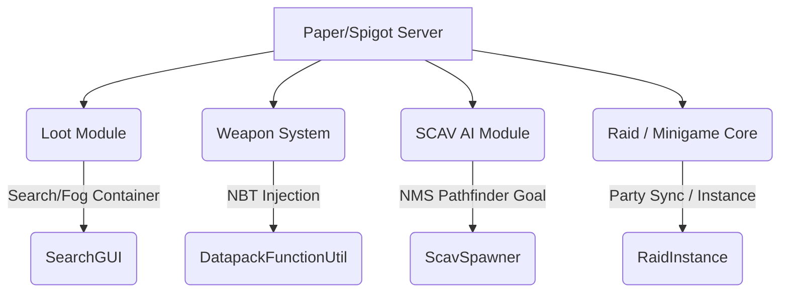

# ImpossbleEscapeMC

<p align="center">
  
  
  
</p>

---

**ImpossbleEscapeMC** is a tactical survival extraction expansion designed for Paper Minecraft servers (1.21.x). It transforms the vanilla survival loop into an intense Escape-from-Tarkov-like experience centering on **Looting**, **Engaging**, and **Extracting**.

Featuring advanced SCAV AI, custom client-server synchronized guns via datapack NBT, deep armor and medical pipelines, and integrated lobby minigames.

---

## 🌟 Key Features

### 🔫 Advanced Weaponry
- **NMS Custom Guns**: Fully server-side generated guns using datapack-compatible NBT components, removing client-side mod requirements.
- **Realistic Gunplay**: Interactive attachments, reload/bolt actions, custom caliber ammo pools, dynamic recoil, and spray patterns.
- **Attachment GUI**: Customize sights, scopes, and grips in real-time.

### 🧠 Intelligent SCAV AI
- **Sensory Behavior**: Visual and auditory search patterns. Enemies react to footsteps, gunshots, and flashlight movements.
- **Tactical Positioning**: Smart use of cover, tactical retreating, squad coordination, and distinct situational voice lines.
- **Spawning Heatmaps**: Dynamic heatmap visualizations to inspect and adjust spawn densities across maps.

### 🎒 Core Mechanics & Looting
- **Search GUI**: Containers and dead players (corpses) must be searched incrementally, revealing items slot-by-slot under a foggy layout.
- **FIR System (Found in Raid)**: Status tracking for looted items to restrict trader listings and auction markets.
- **Armor & Medical Pipelines**: Functional helmets and chest plates with varying armor classes, alongside complex medical kits to treat specific wounds.

### ⚔️ Raid & Party Loop
- **Instance Management**: Lobby queueing, spawn selection, party chat, and extraction zones.
- **Minigame Engine**: Team splits, rounds, loadout selectors, and respawn mechanisms.

---

## ⚙️ Quick Start

### For Server Administrators

1. **Requirements**: Download and run a **Paper 1.21.x** server with **Java 25**.
2. **Installation**:
   - Place the compiled plugin `.jar` in the `plugins/` directory.
   - Start the server once to generate configuration files, then stop it.
   - Configure definitions in `plugins/ImpossbleEscapeMC/` for loot pools (`loot.yml`), items (`items.yml`), and traders (`traders.yml`).
3. **Run**: Start the server and enjoy!

### For Developers

1. **Clone the Repository**:
   ```bash
   git clone https://github.com/RuskServer/ImpossbleEscapeMC.git
   cd ImpossbleEscapeMC
   ```
2. **Build with Maven**:
   ```bash
   mvn clean package
   ```
   The compiled jar will be available in the `target/` directory.

---

## 💻 Commands Cheatsheet

| Command | Description | Permission |
| :--- | :--- | :--- |
| `/getitem <itemId> [amount]` | Acquire specific custom items. | `impossbleescapemc.getitem` |
| `/attachment` | Open attachments editor GUI for the held gun. | *None (All Players)* |
| `/itemreload` | Reload custom items, configurations, and trader files. | `op` |
| `/scavspawn [x y z]` | Manually spawn a SCAV. Use `heatmap` to toggle spawn map. | `op` |
| `/raid <join\|leave\|start\|extract\|scavspawn>` | Complete raid queueing and map interactions. | `op` |
| `/party <create\|invite\|accept\|leave\|kick\|info\|chat>` | Squad management and secure communication. | *None (All Players)* |
| `/loot <container\|egg\|refill\|reload>` | Manage, refill, and place loot crates. | `op` |
| `/trader <open\|reload> [traderId]` | Shop from local traders or reload traders layout. | `op` / `impossbleescapemc.trader.reload` |
| `/mg <create\|setspawn\|split\|start\|stop\|loadout>` | Manage active minigame lobby parameters. | `op` |

---

## 🏗️ System Architecture



---

## 📄 License

This project is licensed under the **AGPLv3 License**. See the [LICENSE](LICENSE) file for more information.
